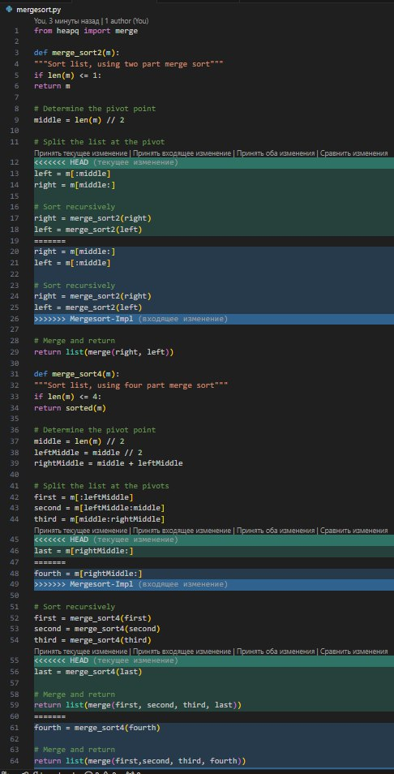

# Оценка 3
## Часть 1
### 1-4

* git log - команда, которая показывает историю коммитов 
* Содержит в себе информацию о хеш коммите, авторе и дате изменения
### 5-10

### 11-15

### 16-17
### Добавил в stage, закомитил и запушил
## Часть 2
### 1-4

### 5-8

### 6-10

### 11-15

### 16

### 17

# Оценка 4

## Часть 1
### 1-4

### 5-10

### 11
git diff - команда, которая показывает различия между версиями файлов, коммитами, ветками и состояниями. 
* git diff будет сравнивать текущий sort.c на диске с sort.c в staged
* git diff --staged покажет различия между sort.c в состоянии staged с последним коммитом для этого файла
### 12-15

### 16

### 17-19

### 20-23

### 24

## Часть 2
### 1-6

### 7-9

### 10-12

### 13-14

### 15-16

### 17-19

# Оценка 5

## Часть 1
### 1-2

### 3-7

### 8

### 9 

Оставил в текстовом файле 2 строки, а именно 2 и 4
### 10-11

## Часть 2
### 1-3

### 4-5

### 6-7

### 8

### 9

### 10-12

* Можно заметить что функции практически одинаковые, тогда везде можно удалить блок HEAD

# Задание *
Создал репозиторий SubModules и добавил в него два файла README.md и functions.c

Переходим в основной репозиторий и добавляем сабмодуль

- Инициализировать повторно не пришлось, так как при добавлении файлов README и functions я клонировал репозиторий в консоли

Добавляем, коммитим и пушим

